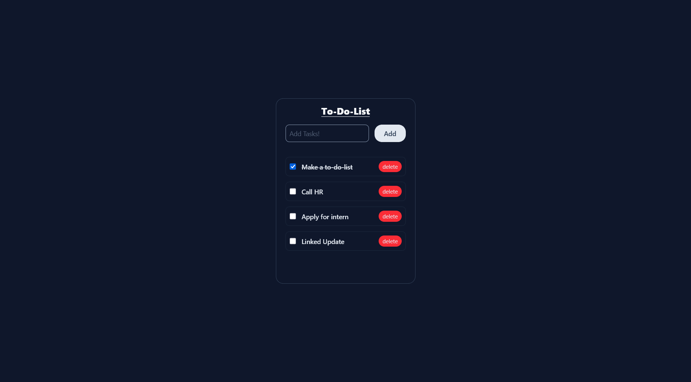

# React To-Do List App

This is a simple and responsive To-Do List application built using **React** and **Tailwind CSS**. It demonstrates modern React practices such as component-based architecture, state management using hooks, and dynamic UI updates with user interaction.

---

## Features

-   Add tasks to the list
-   Delete tasks with a single click
-   Mark tasks as completed with a checkbox (strike-through effect)
-   Clean and minimal user interface
-   Responsive design using Tailwind CSS
-   Unique task IDs for efficient rendering

---

## Preview



## Technologies Used

-   React (with Vite as the build tool)
-   Tailwind CSS
-   JavaScript (ES6+)
-   HTML5 + JSX

---

## Getting Started

**Prerequisites:**

-   Node.js and npm installed on your machine
-   A code editor like Visual Studio Code

**Steps to run the app locally:**

1. Clone the repository:

    ```
    git clone https://github.com/yourusername/react-todo-app.git
    cd react-todo-app
    ```

2. Install dependencies:

    ```
    npm install
    ```

3. Start the development server:

    ```
    npm run dev
    ```

4. Open your browser and go to:
   [http://localhost:5173](http://localhost:5173)

---
